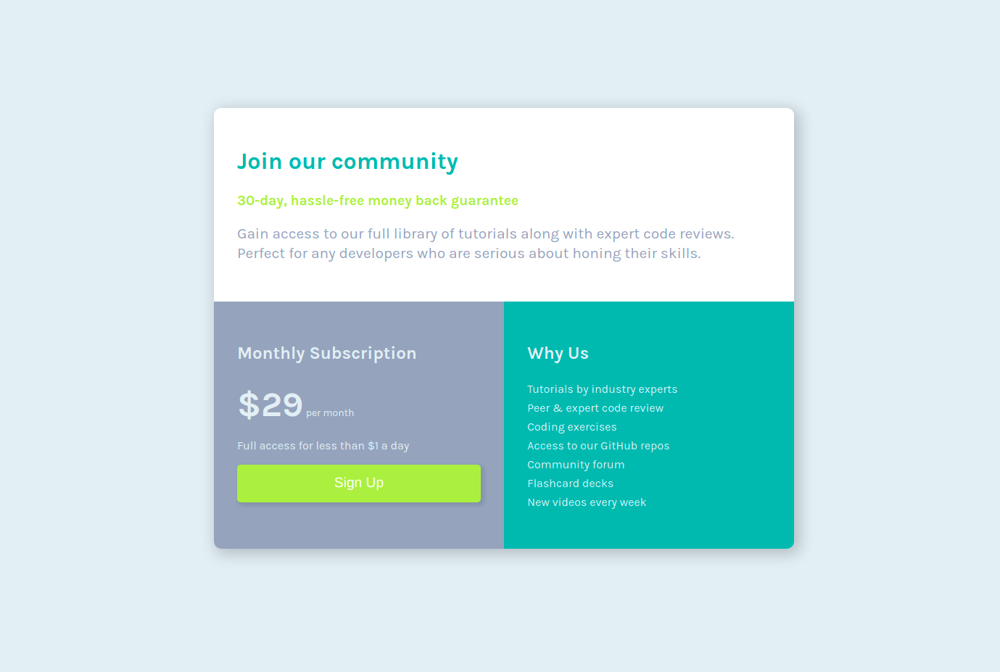

# Frontend Mentor - Single price grid component solution

This is a solution to the [Single price grid component challenge on Frontend Mentor](https://www.frontendmentor.io/challenges/single-price-grid-component-5ce41129d0ff452fec5abbbc). 

## Table of contents

- [Overview](#overview)
  - [The challenge](#the-challenge)
  - [Screenshot](#screenshot)
  - [Links](#links)
  - [Built with](#built-with)
  - [Author](#author)
  - [Acknowledgments](#acknowledgments)
  -  [License](#license)
## Overview
Single price grid component Challenge
### The challenge

Users should be able to:

- View the optimal layout for the component depending on their device's screen size
- See a hover state on desktop for the Sign Up call-to-action

### Screenshot

### Links

- Solution URL: [Solution link](https://github.com/Abdihakim20/huddle-landing-page)
- Live Site URL: [Live site link](https://abdihakim20.github.io/huddle-landing-page/)

### Built with

- Semantic HTML5 markup
- CSS custom properties
- Flexbox

## Author

- Abdihakim
- h.abdihakim01@gmail.com
- 0792002156

## Acknowledgments

Thanks to myself for trying this one out.

## License

[MIT](https://choosealicense.com/licenses/mit/)